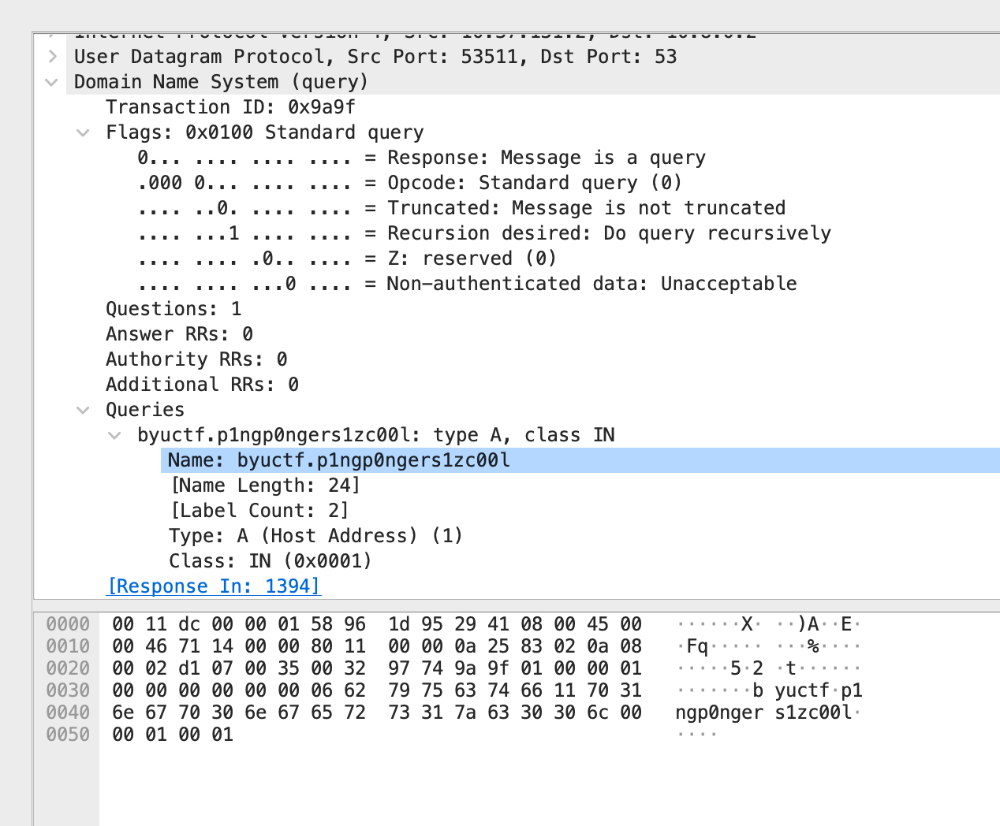

# BYUCTF Winter 2022 - Ding Dong (Easy - Medium) Writeup
* Type - Forensics/Steganography
* Name - Ding Dong
* Points - 518

## Description
```
Here is a packet capture of Ian while on campus one afternoon. 
Can you figure out what he was doing?
```

---

### Ding Dong 1 (Easy)
* 76 Points

#### Question
```
What is Ian's IP and MAC address?
Flag format - byuctf{100.100.100.100_11:22:33:44:55:66}
```

#### Solution
Time to fire up trusty 'ol Wireshark! Opening DingDong.pcapng in Wireshark shows us a list of all the packets that were captured. Since Ian was on BYU campus, I knew the IP would start with `10.37`, as all student devices connected to eduroam campus Wi-Fi are on that subnet. Even without that prior knowledge, 97.9% of packets contained `10.37.131.2` (set the filter to `ip.addr == 10.37.131.2` and look at the lower right hand corner to see that even with that filter on, 4625/4722 packets are being displayed). After opening up any packet that contained `10.37.131.2` in the 'Destination' column in the packet inspector window, you can open the 'Ethernet II' dropdown and pull the MAC address out of the header for the 'Destination' sub-dropdown.

#### Real World Application
This challenge served as a good introduction to Wireshark. Wireshark is a packet capturing tool used to analyze network traffic. This challenge taught us how to set filters to look for specific IP addresses and how to analyze a packet in greater depth.

---

### Ding Dong 2 (Easy)
* 93 Points

#### Question
```
How many different DNS queries of type A were made?
Flag format - byuctf{0000}
```

#### Solution
The first thing I tried for this challenge was applying the `dns.a` filter and just entering the number of packets displayed (again, in the bottom right hand corner). That didn't give me the right answer. Turns out `dns.a` filters by address, not query type. So I had to find a different filter. Instead of just searching for a filter I thought might work, I found a packet that matched the description I was looking for. I filtered using the command
```
dns and (ip.dst==10.37.131.2 or ip.src==10.37.131.2)
``` 

and found 96 results. Later I found that all DNS queries in this capture included `10.37.131.2` somewhere in the source or destination, so I later simplified that filter to just `dns`. In those 96 results, I found a query. I selected the packet, opened it in the viewer, and under the 'Domain Name System (query)' subcategory, I right clicked on the 'Response: Message is a query' line, and selected 'Apply as Filter -> Selected' and went back to my main window. That automatically entered `dns.flags.response == 0` in the filter bar. When I prepended `dns &&`, my list was narrowed to 48 packets that were just DNS queries. Finally, I selected a packet with an 'A' in the info column, opened it in the packet viewer, under 'Queries -> <DNS query>: type A, class IN', right clicked the line that read 'Type: A', and applied that as a filter again. Finally, I added the `dns && dns.flags.response == 0` back into the search bar, so the final filter reads
```
dns && dns.flags.response == 0 && dns.qry.type == 1
``` 

Which gives the correct flag- byuctf{36}
  
#### Real World Application
Packets are sent across networks so fast, packet captures get very large very quickly. Any good analyst needs to be able to apply filters to narrow down the information they're sorting through to find the packets they need to analyze. 
  
---

### Ding Dong 3 (Medium)
* 86 Points

#### Question
```
How many packets have the ACK flag enabled?
Flag format - byuctf{0000}
```

#### Solution
Thankfully, this one was pretty quick. You can filter all packets by their flags using `tcp.flags`. So, to find all the packets with the ACK flag enabled, all you need to do is filter
```
tcp.flags.ack == 1
```

and let Wireshark tell us how many packets meet the criteria.

#### Real World Application
The ACK flag is enabled on packets after a connection has been established between a sending and receiving machines. So, finding the packets with the ACK flag set shows us all the packets that were successfully received.
  
---

### Ding Dong 4 (Medium)
* 91 Points

#### Question
```
What is the version number for the Linux server that sent a packet with redsonic as the user agent?
Flag format - byuctf{1.1.1}
```

#### Solution
Initially, I didn't realize that protocols other than HTTP had user agents. So when I filtered by HTTP to start narrowing down the field and no packets turned up, I was surprised. However, that lead me to Google how I could search packet contents. After clicking the correct icon in Wireshark, selecting 'Packet Details' in the first dropdown, leaving 'Case sensitive' unchecked, and selecting 'String' in the last dropdown, I was able to search for `redsonic` and got a list of packets listing redsonic as the sources's user agent. Clicking on one of those packets and opening it in the detail window, I was able to find the Linux server version under the Simple Service Discovery Protocol.
  
#### Real World Application
OSINT is powerful. In Wireshark, we can get so much information. Even more than just the actual contents of the packets. In this example, we're finding version numbers of operating systems. A knowledgeable attacker can use this knowledge to scour for potential vulnerabilities in their target.

---

### Ding Dong 5 (Medium)
* 83 Points

#### Question
```
What are the two IPs that function as DNS servers?
Flag format - byuctf{10.10.10.10_11.11.11.11}
```

#### Solution
This one took more reading skills than anything else. A quick look over the DNS packets mostly show one server communicating with Ian's laptop (the IP of which we found earlier)- `10.8.0.2`. After looking through the list of packets for another minute or two, I saw the secondary DNS server's IP- `10.8.0.8`.

#### Real World Application
Finding a DNS server is information an attacker can leverage to attack a network. DNS servers are a common target for hackers. In addition to that, this challenge had a surprising application in my life recently. A Windows machine on my home network recently was infected with malware and wasn't able to access the internet despite showing a connection. After inspecting my network packets, I found that all of that machine's DNS requests were going to the wrong place. Instead of going to the Raspberry Pi that I had configured to route DNS traffic through, all my queries headed straight to my printer. After identifying and removing the malware, my internet returned to normal. As it turns out, being able to trace DNS traffic through its proper channels is an incredibly useful skill in troubleshooting network issues.
  
---

### Ding Dong 6 (Medium)
* 89 Points

#### Question
```
What is the hidden flag?
```

#### Solution
Using the technique from above to search for strings within packet info, a search for 'ctf' resulted in this packet

Formatting this peculiar looking string as byuctf{p1ngp0ngers1zc00l} results in a correct flag.

#### Real World Application
This search ability in Wireshark allows defenders to quickly find packets with specified contents or headers.
