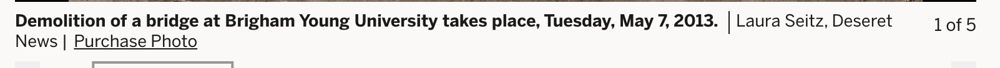
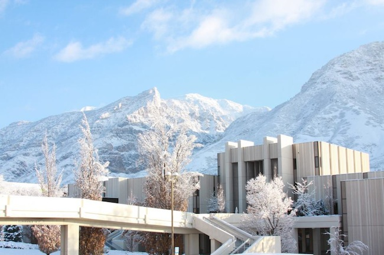
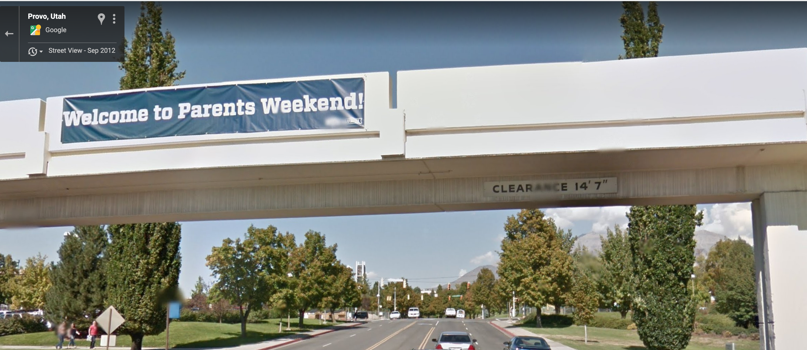

# BYUCTF Winter 2022 - NonSecurityClearance (Easy) Writeup
* Type - OSINT
* Name - NonSecurityClearance
* Points - 442

## Description
```
There once existed a certain bridge on campus that is no more. How much clearance did it have? What day did this demolition project begin?
Flag format - byuctf{feet_inches_YYYY_MM_DD}, like byuctf{10_10_2000_01_01}
```

## Solution
To start, I needed to find the name of the bridge that isn't here anymore. Searching 'byu bridge demolition' on Google gave me several articles and videos from May of 2013. Deseret News is the first site that popped up, so I opened up [this article](https://www.deseret.com/2013/5/9/20519382/byu-s-east-campus-drive-closed-pedestrian-bridge-demolished). Right below the scrolling images, I found this:


Okay. Now I know when the bridge was demolished. Now to find where it was. The very first sentence of the article begins "East Campus Drive ... closed permanently." So I look up "BYU east campus drive pedestrian bridge." I find more specific articles about the destruction of this bridge. None of those articles reallly gave me an idea of where the bridge was. However, I did read more of one article from BYU's Daily Universe, because I thought that source might give me more information, and I'm glad I did. Right there at the beginning of the article it says the destruction started May 6, not May 7 like I got from Deseret News. I went back to the Deseret News site and continued reading. In literally the second half ofthe first sentence, it quite explicitly says that the project started May 6. I'm glad I caught that careless mistake before long. I still didn't have a great idea of where the bridge was though. Eventually I found an old map of East campus and it looks like the bridge connected the JRCB to the WILK. So now I looked up 'JRCB bridge' and found this image in the mix.


I could see a sign indicating the clearance of the bridge. Problem was, I couldn't read it. Time for another approach. I looked up how to go into the past in Google Maps. Once I learned how to do that, it was trivial to drop a street view pin on East Campus Drive, move the time back to 2012, and pan North on East Campus Drive until I saw the bridge. And just like that, we have our answer.


## Real World Application
There are two big takeaways here. First, I learned that speed isn't always the best. Had I not read those two articles more in depth, I would've submitted a wrong flag and probably taken a long time trying to track down my mistake. Sometimes it pays to slow yourself down a bit to give yourself the opportunity to really analyze all the information you have available. Second, I learned how to go into the past in Google Maps. That could be useful in seeing historical development of an area, perhaps finding more information about an area by knowing what buildings and structures used to be there.
